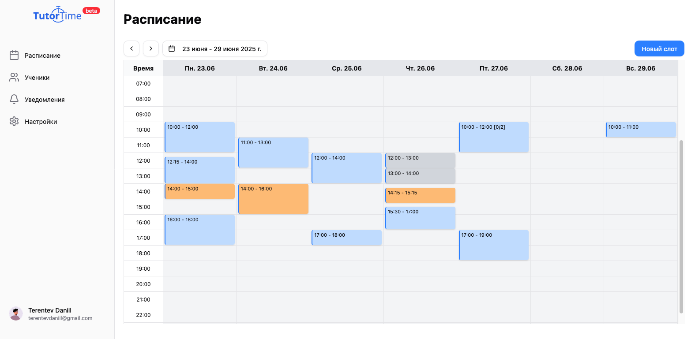
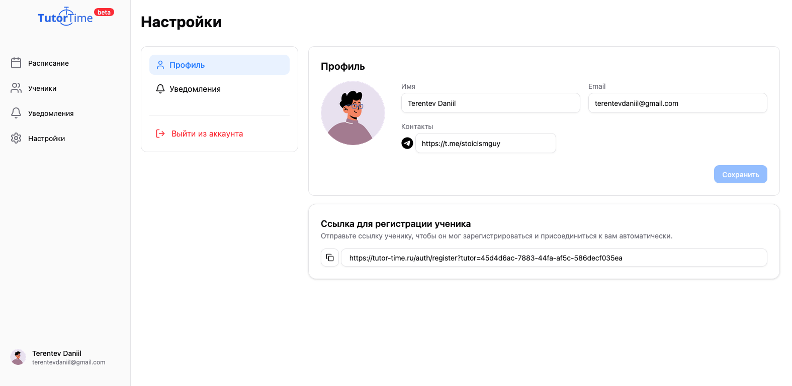
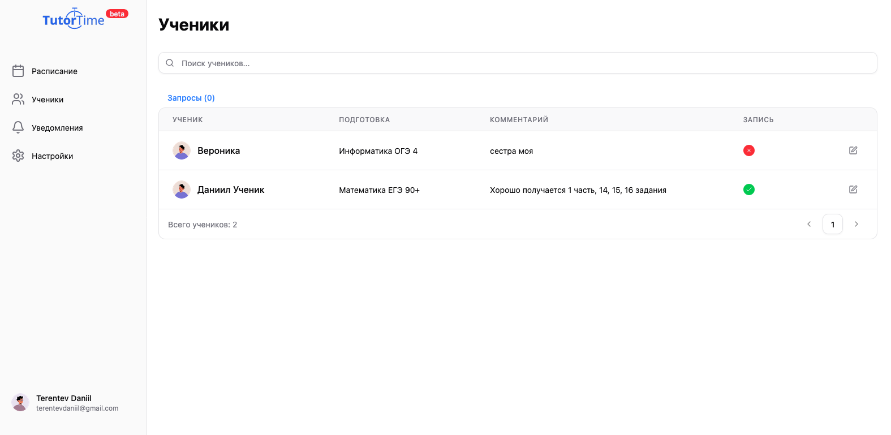
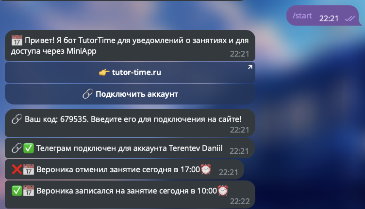

<h1 align="center">🎓 TutorTime</h1>

Умная платформа для репетиторов и их учеников

  
  

---

## 📌 О проекте

**TutorTime** — это платформа, упрощающая жизнь репетиторам:

-   Позволяет **ученикам бронировать и отменять занятия**
-   **Подключает Telegram**, чтобы репетиторы получали уведомления прямо в мессенджере
-   Даёт доступ к удобному онлайн-расписанию
-   В будущем — возможность загружать **материалы, ссылки и домашние задания**

---

## 💡 Мотивация

Проект родился из реальных запросов репетиторов.  
Слишком много времени уходит на переписки, пересогласования и потерянные сообщения.  
TutorTime делает это проще и быстрее — и оставляет время на само обучение.

---

## 🔧 Технологии

| Категория          | Стек                                                                                                                                                                                                       |
| ------------------ | ---------------------------------------------------------------------------------------------------------------------------------------------------------------------------------------------------------- |
| 🧠 Backend         |                          |
| 🎨 Frontend        |   |
| 🛢️ База данных     |                                                                                                    |
| 🐳 Контейнеризация |   |
| 🔗 Интеграции      |                                                                                                          |
| 🔐 Аутентификация  |                 |

---

## 🧩 Реализовано

-   [x] Авторизация преподавателя и ученика
-   [x] Просмотр и изменение расписания
-   [x] Уведомления через Telegram
-   [x] Отмена и бронирование занятий
-   [x] Панель преподавателя
-   [x] Сбор MVP за **11 дней**

---

## 🔗 Ссылки

🌐 **Сайт:** [tutor-time.ru](https://tutor-time.ru)

---

## 📸 Скриншоты

  
   <em>Просмотр расписания</em>

  
   <em>Профиль</em>

  
   <em>Ученики</em>

  
   <em>Telegram-интеграция</em>

---

## 🛣️ В планах

-   [ ] Загрузка и привязка материалов к занятиям
-   [ ] Домашние задания и ссылки
-   [ ] Оплата занятий внутри платформы
-   [ ] Публичные страницы преподавателей
-   [ ] Мобильная версия + адаптивность

---

## 🧑‍💻 Автор

**Даниил Терентьев**  
Python / Django / Fullstack разработчик  
Telegram: [@stoicismguy](https://t.me/stoicismguy)
