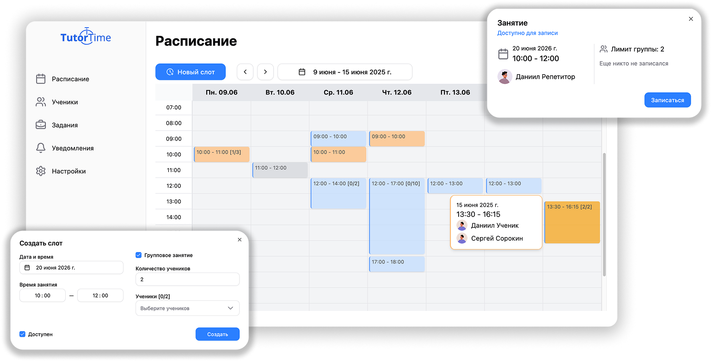
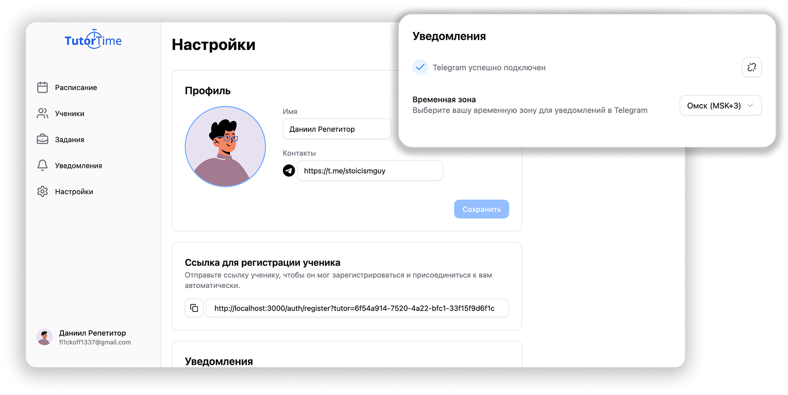
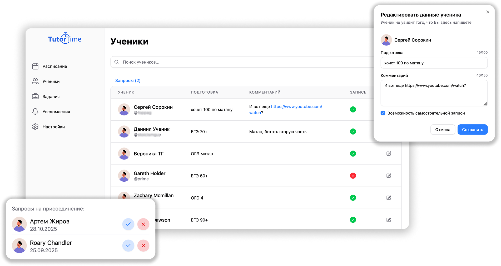
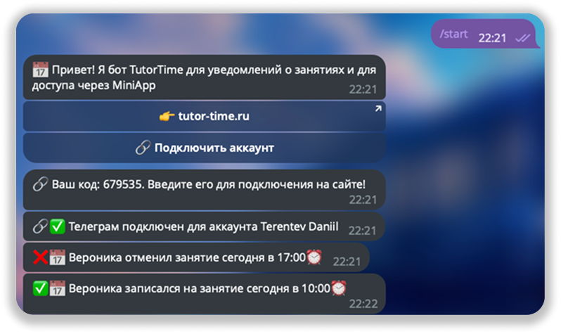
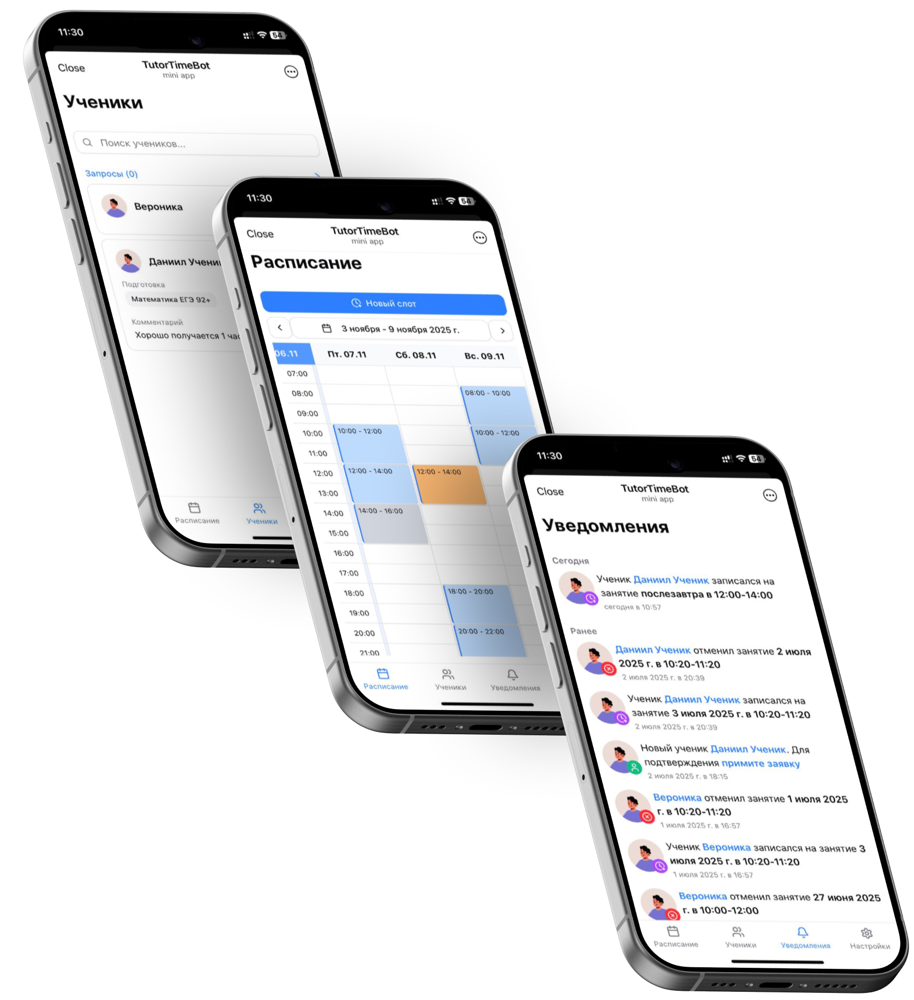

# 🎓 TutorTime

**Smart CRM & Booking Platform for Tutors and Students**

  
  
  
  
  

[Project Overview](#-project-overview) • [Features](#-features) • [Telegram Ecosystem](#-telegram-ecosystem) • [Tech Stack](#-tech-stack)

---

## 📌 Project Overview

**TutorTime** is an end-to-end B2B SaaS platform built to simplify the administrative workflow for private tutors. 

Tutors waste hours every week on scheduling, rescheduling, and sending reminders manually. TutorTime automates this process by providing a clean web interface for scheduling management and seamless **Telegram Bot/Mini App integration** for instant notifications and booking.

> **Development Speed:** The core MVP (including backend logic, frontend, auth, and Telegram integration) was built and shipped in **11 days**.

 

  

 

  
<b>🖥️ Click to view more Web Interface screens (Profile, Students, Integrations)</b>

   
  

    
      
    
      
    
  

 

## 🚀 Features

- **Role-Based Access:** Separate dashboards and workflows for Tutors and Students.
- **Smart Scheduling Engine:** Booking system with conflict prevention and automated slot management.
- **Telegram Ecosystem:** Tutors and students receive instant notifications via a Telegram Bot.
- **Authentication:** Secure JWT & OAuth 2.0 implementation with seamless Telegram `initData` login support.
- **Student Management:** Centralized dashboard to track student progress and upcoming lessons.

---

## 📱 Telegram Ecosystem

  

 

While the platform has a full web interface, the core user experience is built around the **Telegram Mini App**. 

Instead of forcing users to download a standalone app or constantly log into a website, TutorTime integrates directly into the messenger they already use daily:

- **Seamless Login:** Uses Telegram `initData` to securely authenticate users without passwords.
- **Native UI:** The Mini App interface is heavily optimized for mobile, offering a faster and cleaner experience than the web dashboard.
- **Push Notifications:** Instant alerts for new bookings, cancellations, or schedule changes delivered directly by the bot.
- **Quick Booking:** Students can open the bot and book a slot in 3 clicks without leaving Telegram.

---

## 🛠 Tech Stack

### Backend

  
  
  
  

### Frontend

  
  
  
  

### Infrastructure & Integrations

  
  
  

---

 

  
<i>Crafted with passion for engineering</i>

  

 
